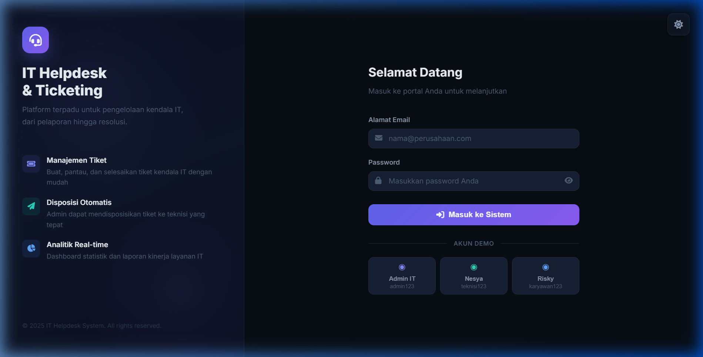
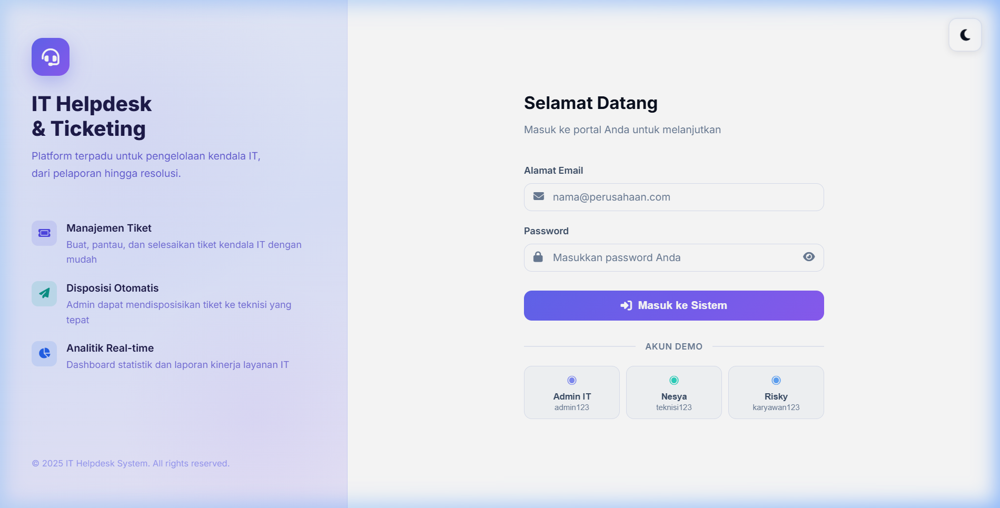
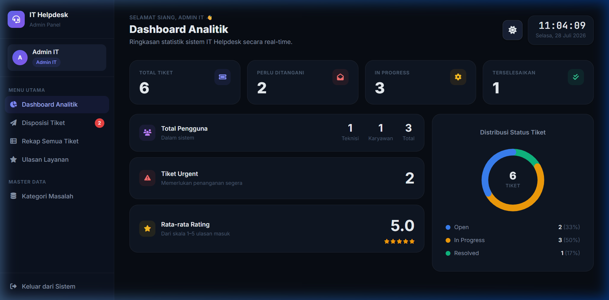
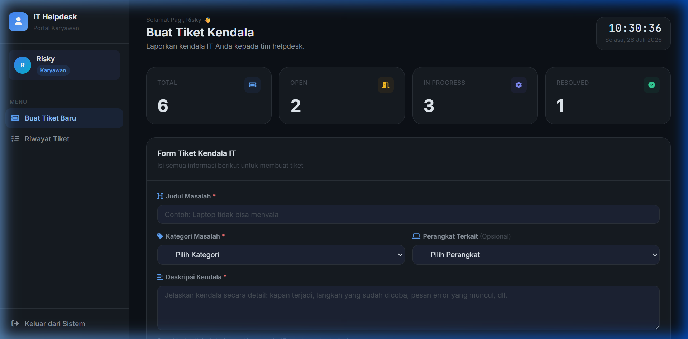
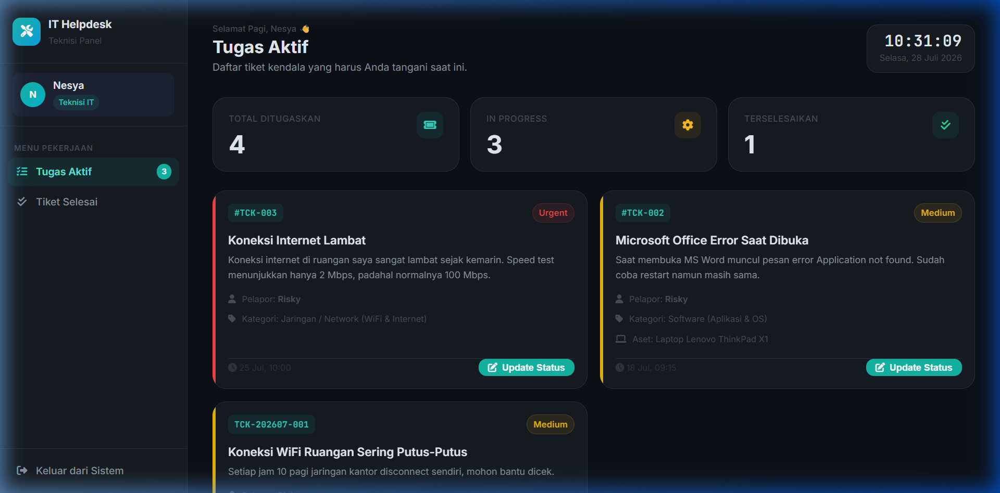

# Laporan Project - IT Helpdesk & Ticketing System

---

## Identitas Programmer
- **Nama**: Nesya Kirani Nurroffi
- **Kelas**: XII PPLG-RPL 2
- **Sekolah**: SMKN 1 Cianjur

---

## Deskripsi Project
Sistem IT Helpdesk & Ticketing ini adalah sebuah aplikasi berbasis web yang dirancang khusus untuk memfasilitasi pelaporan, pemantauan, dan penyelesaian kendala IT di dalam suatu perusahaan atau institusi. 

Aplikasi ini dibangun menggunakan arsitektur *Native PHP* yang tangguh berpadu dengan *MySQL* sebagai basis data. Di sisi antarmuka, aplikasi ini menggunakan *Tailwind CSS* untuk tata letak modern dan *CSS Custom Variables* untuk mewujudkan fitur **Dark Mode & Light Mode** yang dinamis, interaktif, bersih, rapi, dan berkualitas premium (SaaS Level).

## Fitur Utama
1. **Multi-Role User**: Sistem mengakomodasi tiga hak akses yang berbeda (Admin IT, Teknisi IT, dan Karyawan) dengan kapabilitas masing-masing.
2. **Dark Mode & Light Mode**: Desain UI/UX dapat diubah mode warnanya yang state-nya persisten disokong oleh `localStorage`.
3. **Manajemen Tiket Terpadu**: Mulai dari tahap pelaporan oleh Karyawan, penugasan (disposisi) oleh Admin, hingga penanganan (resolusi) oleh Teknisi IT.
4. **Tracking Real-time**: Karyawan dapat memantau jejak perubahan status secara *real-time* (Pending, In Progress, Resolved).
5. **Ulasan Layanan**: Setelah tiket selesai ditangani, Karyawan dapat memberikan _rating_ dan _feedback_ atas kualitas penyelesaian kendala.
6. **Dashboard Analitik**: Informasi statistika penyelesaian tiket divisualisasikan dengan elegan untuk pemantauan kualitas layanan (SLA).

---

## Dokumentasi Halaman (Antarmuka Premium)

### 1. Halaman Login (Split-Screen Modern)
Halaman ini adalah pintu masuk sistem. Dilengkapi dengan toggle mode gelap/terang, desain menggunakan _glassmorphism_, gradient mulus, dan kartu interaktif dengan micro-animasi yang premium. 

**Login Mode Gelap (Dark Mode):**

**Login Mode Terang (Light Mode):**

### 2. Dashboard Admin IT
Panel ini diperuntukkan untuk Koordinator IT/Admin untuk mengelola tiket, melakukan pendisposisian tiket kepada teknisi, mengatur data master, dan menganalisa efisiensi layanan. (Mode Gelap).

### 3. Dashboard Karyawan
Karyawan dapat melaporkan keluhan IT serta melacak progres penanganan dari tiket yang sudah pernah mereka buat sebelumnya. Warna aksen disesuaikan dengan biru elegan.

### 4. Dashboard Teknisi IT
Panel ini merupakan meja kerja teknisi, di mana setiap penugasan masuk akan diproses dengan pendekatan mirip metode *Kanban*, yang memberikan batas visualisasi timeline penanganan dan rincian kontak pelapor.

---

## Kesimpulan
Pengembangan "IT Helpdesk & Ticketing System" ini menunjukkan perpaduan logika backend (Native PHP) yang solid dengan presentasi antarmuka frontend (Premium CSS + Tailwind) masa kini yang sangat mengedepankan fungsionalitas sekaligus kenyamanan visual (UI/UX) bagi penggunanya.
